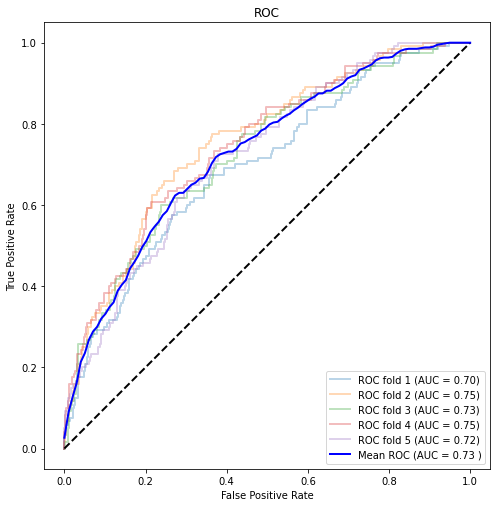
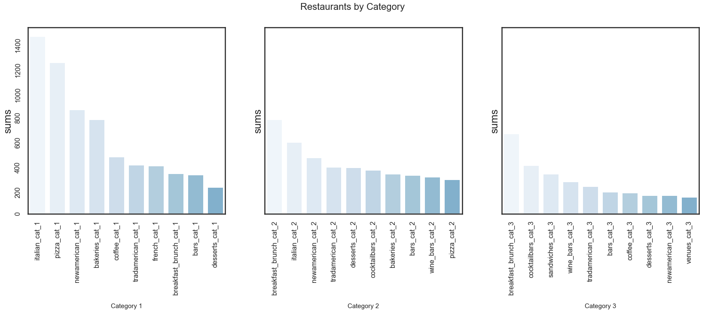
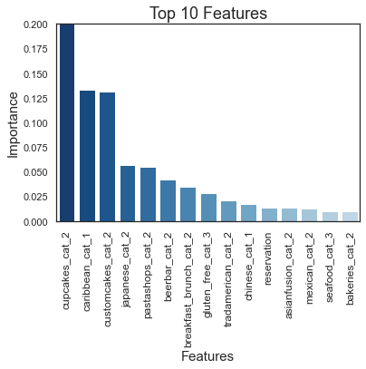
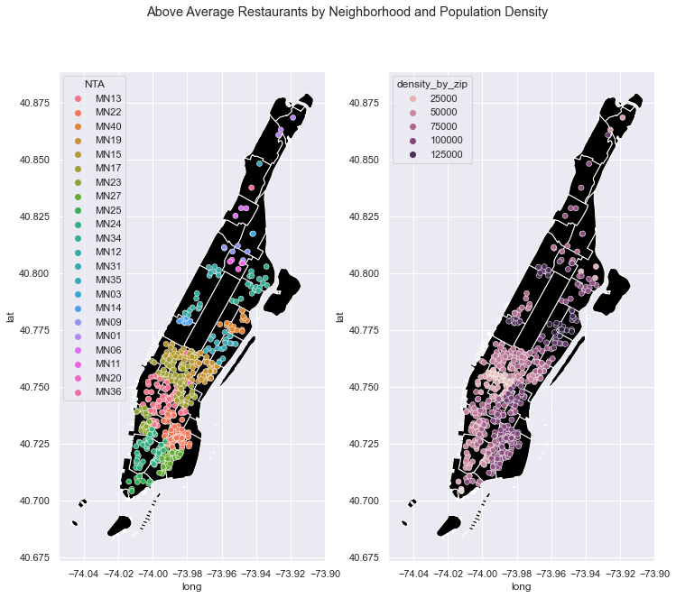
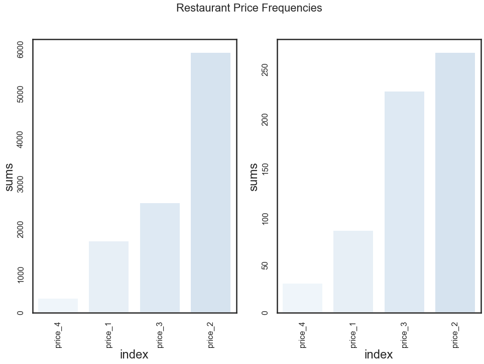

# The Recipe for Success: Build a Better Restaurant in NYC
In this project, I outline a strategy for building a competitive restaurant in New York City. In this case, I define a competitive restaurant in NYC by Yelp star rating. According to Yelp, the average restaurant earns a rating of 4.0, which means in order to be competitive you must have 4.5 or above out go five. I build a model that predicts with .78 accuracy and .605 precision that a restaurant will have a 4.5 rating or above. Based on the results of that model I’ve developed a strategy for success in NYC.

## Navigating the Repo
In the list of files below, choose the folder  ‘Mod3-Restaurant Project’
| Mod3-Restaurant Project    | File Description              |
|:---------------------------|:------------------------------|
| /data                      |  a folder containing various CSV data files used in this project |
| /images.                   | a folder containing various images used in this project          |
| Part1_ObtainingScrubbing.jpynb | a jupyter notebook of the process of obtaining and scrubbing the data for this project  |
| Part2_EDA.jpynb                | a jupyter notebook of the process of exploratory data analysis for this project  |
| Part3_Modeling.jpynb           | a jupyter notebook of the various models created for this project, with results  |
| NYCRestaurantPresentation.pdf  | a high-level overview of the results of this project  |

## The Data
The data collected for this project came from Yelp Fusion API Business Search and NYC Open Data. The Yelp data provided a list of over 3000+ restaurant observations in Manhattan. Yelp also provided our target feature, rating, as well as information about the restaurant’s location, price, category, the amount of reviews it has received, and the kinds of transactions you make (reservation, delivery, and pickup).  NYC OpenData provided the names of neighborhoods, their NTA (Neighborhood Tabulation Area) identifier, as well as population demographics. 

For the purposes of this project, I only looked at independent restaurants that had less than five separate locations in Manhattan. 

## The Methodology
#### Obtaining & Scrubbing
1. I obtained a list of zip codes for Manhattan from NYC Open Data that corresponded with a list of neighborhoods.
2. I used the list of neighborhoods as my location in the Yelp API, and retrieved a list of over 3000+ unique restaurants.
3. I processed that data using a function to unpacked the features that I needed from the JSON format that Yelp API returns. Completing this step eliminated the need for a lot of One Hot Encoding later. It also eliminated certain features like the URL, or image URL that were unnecessary for the analysis and made the data more difficult to read.
4. This function also changed the Yelp rating to a new feature called ‘above_avg’ that indicates if the rating is above average or not. This was necessary in order to perform a binary classification.
5. Next, I mapped the NYC Open Data to the Yelp Data using the zip code as a key.
6. The data was then checked for missing and unusual values or any duplicates that may have been missed.
7.  Since there were a large number of columns due to the number of categories for Yelp restaurants,  I eliminated any columns that had no observations because the observations had been removed due to another process.

### EDA
1. I generated visualization to analyze the distribution of the different restaurant categories, locations, and prices.
2. I checked the distributions of continuous data like review count, population and density.
3. I checked for a class imbalance in our target feature.

## Modeling
1. Since I knew that I had a class imbalance as well as a non normal distributions,  I wanted to choose a model that was appropriate. I found a few different classifiers that seemed like they might good: Random Forest Classifier, Balanced Random Forest Classifier, Balanced Bagging Classifier, and Easy Ensemble Classifier. I also employed Random Forest Classifier with SMOTE.
2. I ran each of these models through a loop that tried the classifier in two different ways: once with train, test, split,  and one using cross validation.
3. I generated a data frame for each model contains the AUC, accuracy, precision, recall, and F1 scores for each fold, as well as the mean for the fold.
4. I generated a confusion matrix, ROC curve, and cross validated mean ROC curve for each model.
5. I attempted to improve the model by using RandomizedSearchCV to find the best parameters.
6. I analyzed the feature importances and generated a list of the best features for my recommendations.

## The Results
Of all the scores, precision is our most important metric. This is because the cost of false positives in our business case in greater than the cost of false negatives. A false negative may narrow the recommendation, but false positives could make the recommendations too broad and create a waste of resources.        

### The Best Model
The best model was Model 8. This model was created using the original Random Forest Classifier, with the hyper parameters suggested by RandomSearchCV.

Based on the model and the EDA, I can make the following recommendations:

### Concept
The most important features the model identified were related to the restaurant categories. It seems bakeries,  Japanese restaurants, and Caribbean restaurants are high on the list. In addition, traditional American, diner, and breakfast places are also well represented. We also see that gluten-free appears among the top 15 features indicating that restaurants with more gluten-free items of any concept perform well. The presence of reservations on this list indicates that the sit-down concepts are more likely to have a high rating.       

### Location
* Above average restaurants seem to be clustered in certain neighborhoods, namely: These areas have medium population density. 
* Above average restaurants also have a high number of reviews. A higher amount of reviews suggests that more people are visiting that restaurant.
* This suggests that a there is an entourage effect — being in proximity to other restaurants with a high rating means more foot-traffic. More diners will also see your restaurant and might want to try yours.      

### Price
* Price is an important feature due to perceived value. Finding the right price is about balancing costs with the quality of food that you want to provide. Developing a concept that has the right price should be gauged by the neighborhood. In both average and above average restaurants, price tiers two and three are over represented. However, in above average restaurants, price tier three appears more frequently than in restaurants that are not above average. This suggests that customers still perceive more expensive food as being worth the money sometimes. This indicates that it might be a good idea to do further research with menu scraping to determine what price point is most appropriate based on neighborhood and concept.       

## Future Work
### Addressing the top two levels of the pyramid:
* Performing sentiment analysis to assess customer values as well as positive and negative experiences.
* Obtaining additional data to find broader trends to make more precise recommendations.
* Obtaining additional data to explore options that encourage brand loyalty.

### Assessing the impact of Covid-19:
* Collecting data regarding patterns in consumer habits during the times of Covid-19.
* Using time-series to predict how these patterns will evolve going forward.

Thanks for taking a look!

